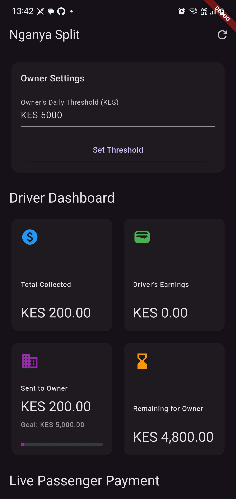

# nganya-split

A Flutter App Prototype Made For The Kopo Kopo and Cashia Hackathon At FlutterConKe 2025 demonstrating automated payment splits for matatu (nganya) drivers using the Kopo Kopo K2 Connect Flutter SDK and Cashia API.

The Core Concept

In the matatu industry, drivers often have a daily "squad" (target amount) they must remit to the vehicle owner. Any revenue earned after meeting this target is theirs to keep.

Nganya Split is a simple app that simulates and automates this process.

Set Target: The vehicle owner sets their required daily threshold (e.g., KES 5,000).

Receive Payments: The driver receives passenger fares using the Kopo Kopo (K2 Connect) SDK.

Automated Split: The app's logic automatically allocates payments.

All funds received go to the "Owner's Pot" until the KES 5,000 threshold is met.

Once the threshold is met, all subsequent payments for the rest of the day are automatically routed to the "Driver's Earnings."

This prototype demonstrates a "no-backend" approach, perfect for a fast-paced hackathon, by using Hydrated Bloc to persist all financial state directly on the device.

Tech Stack

Flutter: For the cross-platform mobile UI.

Kopo Kopo (K2 Connect) SDK: To initiate a live STK Push payment bottom sheet (using the Sandbox environment).

Hydrated Bloc: For "serverless" state management. The app's entire state (totals, thresholds, logs) is saved to the device, so you can close and reopen the app without losing data.

How to Demo the App

Set Threshold: As the "Owner," enter a daily threshold (e.g., 200) and tap "Set Threshold."

Simulate Payment: As the "Driver," tap "Add KES 50" or "Add KES 100."

Enter Phone: A dialog will appear. Enter a Kopo Kopo Sandbox-compatible phone number (e.g., 0700000000).

Kopo Kopo SDK: The official Kopo Kopo payment bottom sheet will slide up. This shows a real integration.

Simulate Success: For the hackathon, just dismiss the bottom sheet (by tapping "Cancel" or swiping down). The app is programmed to treat any dismissal as a "successful payment" to speed up the demo flow.

Watch the Magic: You will see the "Total Collected" and "Sent to Owner" dashboards update.

Meet the Target: Keep adding payments until the "Sent to Owner" amount meets the threshold.

Earn for Yourself: The next payment you add will now go to the "Driver's Earnings" dashboard, proving the split logic works.

View Logs: The "Transaction Log" shows a real-time record of every event.

Test Persistence: Close the app completely and reopen it. The dashboard will still have all your data!

⚠️ IMPORTANT: Hackathon Security Warning

This is a HACKATHON PROTOTYPE and is NOT secure for production use.

Insecure Keys: The Kopo Kopo Client ID, Client Secret, and API Key are hard-coded in the lib/bootstrap.dart file.

Real-World App: In a production environment, all API keys and communication with Kopo Kopo must be handled by a secure backend server, which the app would communicate with.

## Screenshots

### Samsung Galaxy Note 10+

|                                                                       |                                                                       |                                                                       |
| --------------------------------------------------------------------- | --------------------------------------------------------------------- | --------------------------------------------------------------------- |
|  |  |  |

---
